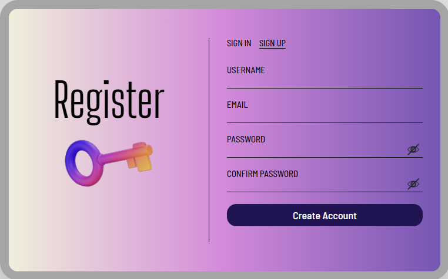

# Register Login Landing Page

Register/Login is a secure user authentication and authorization system that I built using HTML, CSS, and JavaScript for the frontend, and Node.js with MongoDB for the backend. It enables users to register, log in, update their passwords, and delete their accounts, with all operations securely managed using the Passport npm package. This system showcases my ability to develop full-stack applications with a strong focus on security and user experience.

## Technologies Used
* HTML5
* CSS3
* JavaScript
* Node.js
* Express
* MongoDB
* npm packages used:
    * passport
    * passport-local
    * passport-local-mongoose
    * express-session
    * mongoose
    * axios
    * connect-mongo
    * cors

## Authentication and Authorization
* **Authentication** occurs when a user signs in through the Sign-In page. The [backend Node.js application](https://github.com/SukhbirChung/Register-Login-Backend-Application) uses the Passport npm package to handle user authentication and authorization.
* **Authorization** takes place when a user attempts to access the current page that you are reading right now. Only authenticated users are authorized to view this page. If an unauthenticated user tries to access it, they will be redirected to the Sign-In page.

## Detailed Overview of CRUD Operations
1. **Create (Sign Up)**  
In the Register/Login project, the **Create operation** is demonstrated when a user's email, username, and hashed password are written to the MongoDB database. Below is a list of checks performed before storing the credentials in the database:
    * Providing a username, email, and password is mandatory, and the sign-up process will not proceed unless all fields are filled.
    * Custom validation is implemented to ensure:
        * The username is not empty and does not have spaces.
        * The email is in the correct format using regular expressions.
    * Implemented validation to ensure strong passwords are used:
        * No empty spaces are allowed.
        * Must be at least 8 characters long and at most 12 characters allowed.
        * Must include at least one uppercase letter, one lowercase letter, and one special character.
    * A 6-digit confirmation code is sent to the user's email to verify its validity and prevent fake entries. The account is created only after the correct code is entered by the user.
    * Passwords are hashed using the **Passport npm package** before being stored in the MongoDB database.
2. **Read (Sign In)**  
In the Register/Login project, the **Read Operation** is demonstrated when a user's username and password are read from the database for authentication and signing out. Below is a list of actions performed during the user sign-in and sign-out process:
    * Users can only log in using their registered email and password.
    * UserHomepage is secured and only authroized users can access the page.
    * Sessions and cookies are used to maintain user login status across different pages. The session data is stored in the MongoDB database using **connect-mongo** npm package.
    * Redirects users to the userHomepage upon successful login.
    Redirects users to the Sign In page upon successful sign out.
3. **Update (Password Update)**  
In the Register/Login project, the **Update Operation** is demonstrated when a user forgets their password and submits a Forgot Password request. A Forgot Password link is provided on the Sign-In page. Below is a list of actions performed during the password reset process:
    * When a user requests a password reset, an email is sent with a link containing a token to ensure it's the correct user. The link expires in 1 hour.
    * The new password is hashed and securely stored in the database, replacing the old one.
    * The token is deleted from the database after the password is updated securely.
4. **Delete (Account Deletion)**  
In the Register/Login project, the **Delete Operation** is demonstrated when a user clicks on the Delete Account button. Below is a list of actions performed during the account deletion process:
    * Users can permanently delete their accounts after confirming their decision.
    * Removes the user's data from the MongoDB database, including credentials and any associated information.
    * Session data associated with the user is cleared from the MongoDB database.
    * Redirects users to Sign In Page after successful deletion.

Register/Login can be visited at [https://registerlogin.ca/](https://registerlogin.ca/)

